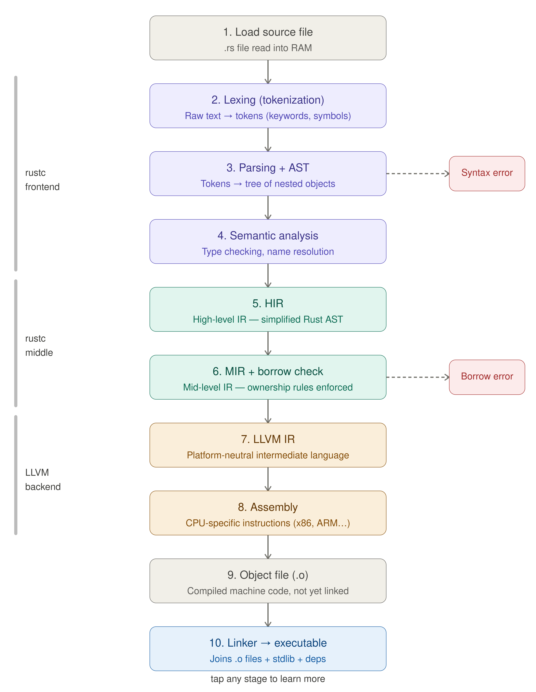

# rustc (the compiler of RUST)

## fun fact about rustc
- rustc is compiler but it is builded with what ?
_ its builded by rust ?
- but rust compiles with rustc ?
- yeah so in the begining there is no rustc the first version is builded with ocaml high level language used for accuracy i think .

## the full procces of compiling rust to executable code.



## Basic usage
 
```bash
rustc [OPTIONS] <file.rs>
```
 
---
 
## Basic commands
 
| Command | What it does |
|---------|-------------|
| `rustc main.rs` | Compile a single file → produces `./main` executable |
| `rustc main.rs -o hello` | Same but name the output `hello` |
| `rustc --version` | Show installed rustc version |
| `rustc --help` | Show all available flags |
| `rustc --explain E0502` | Show a detailed explanation of a specific error code |
| `rustc --print target-list` | List all platforms rustc can compile for |
| `rustc --print cfg` | Show compiler config values for the current target |
| `rustc --print sysroot` | Show where Rust is installed |
| `rustc --print target-cpus` | List CPU types you can target |
| `rustc --print native-static-libs` | Show libs needed when linking statically |
 
---
 
## Edition flag
 
| Flag | What it does |
|------|-------------|
| `--edition 2015` | Use Rust 2015 edition (original) |
| `--edition 2018` | Use Rust 2018 edition (improved module system) |
| `--edition 2021` | Use Rust 2021 edition (recommended, current default) |
 
```bash
rustc --edition 2021 main.rs
```
 
> In a Cargo project, the edition is set in `Cargo.toml` — you never pass this flag manually.
 
---
 
## Output / emit flags
 
These let you see what each stage of the compiler produces instead of a final binary.
 
| Flag | What it outputs | Pipeline stage |
|------|----------------|---------------|
| `--emit=mir` | MIR — mid-level IR, shows borrow checking output | Stage 6 |
| `--emit=llvm-ir` | LLVM IR — human-readable intermediate language | Stage 7 |
| `--emit=asm` | Assembly code — CPU-specific instructions | Stage 8 |
| `--emit=obj` | Object file (.o) without linking | Stage 9 |
| `--emit=link` | Final linked executable (default behavior) | Stage 10 |
| `--emit=metadata` | Crate metadata only (used by Cargo internally) | — |
| `--emit=dep-info` | Dependency info file (like a Makefile .d file) | — |
 
You can combine them:
```bash
rustc --emit=llvm-ir --emit=asm main.rs
```
 
---
 
## Optimization flags
 
| Flag | What it does |
|------|-------------|
| `-O` | Enable optimizations (shorthand for `-C opt-level=2`) |
| `-C opt-level=0` | No optimization — fastest compile, slowest binary (default debug) |
| `-C opt-level=1` | Basic optimization |
| `-C opt-level=2` | Standard optimization (same as `-O`) |
| `-C opt-level=3` | Aggressive optimization |
| `-C opt-level=s` | Optimize for binary size |
| `-C opt-level=z` | Optimize for binary size even more aggressively |
 
```bash
rustc -O main.rs               # optimized build
rustc -C opt-level=3 main.rs   # max optimization
```
 
> In Cargo: `cargo build` = opt-level 0, `cargo build --release` = opt-level 3.
 
---
 
## Codegen flags (`-C`)
 
These control how rustc generates machine code.
 
| Flag | What it does |
|------|-------------|
| `-C debuginfo=0` | No debug info (default in release) |
| `-C debuginfo=1` | Line tables only |
| `-C debuginfo=2` | Full debug info (default in debug builds) |
| `-C debug-assertions=yes` | Enable debug assertions (bounds checks etc.) |
| `-C debug-assertions=no` | Disable them |
| `-C overflow-checks=yes` | Panic on integer overflow |
| `-C overflow-checks=no` | Wrap on integer overflow (faster) |
| `-C lto=thin` | Enable thin link-time optimization |
| `-C lto=fat` | Enable full link-time optimization (slower compile, faster binary) |
| `-C panic=unwind` | Unwind the stack on panic (default) |
| `-C panic=abort` | Abort immediately on panic (smaller binary) |
| `-C target-cpu=native` | Optimize for your exact CPU model |
| `-C target-cpu=generic` | Safe generic CPU target |
| `-C strip=symbols` | Strip debug symbols from output |
| `-C strip=debuginfo` | Strip debug info only |
| `-C incremental=<path>` | Enable incremental compilation (Cargo does this automatically) |
 
```bash
rustc -C target-cpu=native -C lto=fat -O main.rs   # maximum performance build
rustc -C panic=abort -C opt-level=z main.rs         # minimum size build
```
 
---
 
## Target flags (cross-compilation)
 
| Flag | What it does |
|------|-------------|
| `--target <triple>` | Compile for a different platform |
| `--print target-list` | List all valid target triples |
 
```bash
rustc --target x86_64-unknown-linux-musl main.rs    # Linux static binary
rustc --target wasm32-unknown-unknown main.rs        # WebAssembly
rustc --target aarch64-apple-darwin main.rs          # Apple Silicon Mac
```
 
> A "target triple" is a string like `<arch>-<vendor>-<os>` that fully describes a platform.
 
---
 
## Lint flags
 
| Flag | What it does |
|------|-------------|
| `-A <lint>` | Allow (silence) a lint warning |
| `-W <lint>` | Warn on a lint |
| `-D <lint>` | Deny a lint (treat it as an error) |
| `-F <lint>` | Forbid a lint (deny + can't be overridden) |
| `-W warnings` | Enable all warnings |
| `-D warnings` | Treat all warnings as errors |
 
```bash
rustc -D warnings main.rs        # fail if any warning exists
rustc -A dead_code main.rs       # silence "unused code" warnings
```
 
---
 
## Input / output flags
 
| Flag | What it does |
|------|-------------|
| `-o <file>` | Name the output file |
| `--out-dir <dir>` | Put output files in this directory |
| `--crate-name <name>` | Set the crate name manually |
| `--crate-type bin` | Output a binary executable (default) |
| `--crate-type lib` | Output a library |
| `--crate-type staticlib` | Output a static library (.a) |
| `--crate-type cdylib` | Output a C-compatible dynamic library (.so / .dll) |
| `--crate-type rlib` | Output a Rust library (used by Cargo) |
 
```bash
rustc --crate-type cdylib lib.rs    # build a .so / .dll for use from C or Python
```
 
---
 
## Verbose / diagnostic flags
 
| Flag | What it does |
|------|-------------|
| `--verbose` | Show extra information during compilation |
| `--error-format=json` | Output errors as JSON (used by editors and tools) |
| `--error-format=human` | Normal human-readable errors (default) |
| `--color=always` | Force colored output |
| `--color=never` | Disable colored output |
| `--color=auto` | Color only if terminal supports it (default) |
| `--time-passes` | Show how long each compiler pass takes |
 
---
 
## Extern / linking flags
 
| Flag | What it does |
|------|-------------|
| `--extern <name>=<path>` | Manually provide an external crate (Cargo does this automatically) |
| `-L <dir>` | Add a directory to the library search path |
| `-l <lib>` | Link against a native library |
 
```bash
rustc main.rs -L ./libs -l mylib    # link against a custom native library
```
 
---
 
## The most useful commands in practice
 
```bash
# See what MIR looks like for your code
rustc --emit=mir main.rs && cat main.mir
 
# See what LLVM IR looks like
rustc --emit=llvm-ir main.rs && cat main.ll
 
# See the assembly output
rustc --emit=asm main.rs && cat main.s
 
# Understand a specific error
rustc --explain E0502
 
# Check what target platforms are available
rustc --print target-list
 
# See your rustc version
rustc --version
 
# Maximum performance build
rustc -O -C target-cpu=native -C lto=fat main.rs
 
# Minimum binary size build
rustc -C opt-level=z -C panic=abort -C strip=symbols main.rs
```
 
---
 
## Quick cheat sheet
 
```
rustc main.rs                    → compile to executable
rustc main.rs -o name            → compile with custom output name
rustc --explain E0XXX            → explain an error code
rustc --emit=mir main.rs         → see MIR output
rustc --emit=llvm-ir main.rs     → see LLVM IR output
rustc --emit=asm main.rs         → see assembly output
rustc -O main.rs                 → optimized build
rustc --target <triple> main.rs  → cross-compile
rustc -D warnings main.rs        → warnings as errors
rustc --version                  → show version
rustc --print target-list        → list all platforms
```
 
---
 
> **Remember:** In a real project you use Cargo, not rustc directly.
> All of these flags have Cargo equivalents set in `Cargo.toml` or via `cargo` subcommands.
 